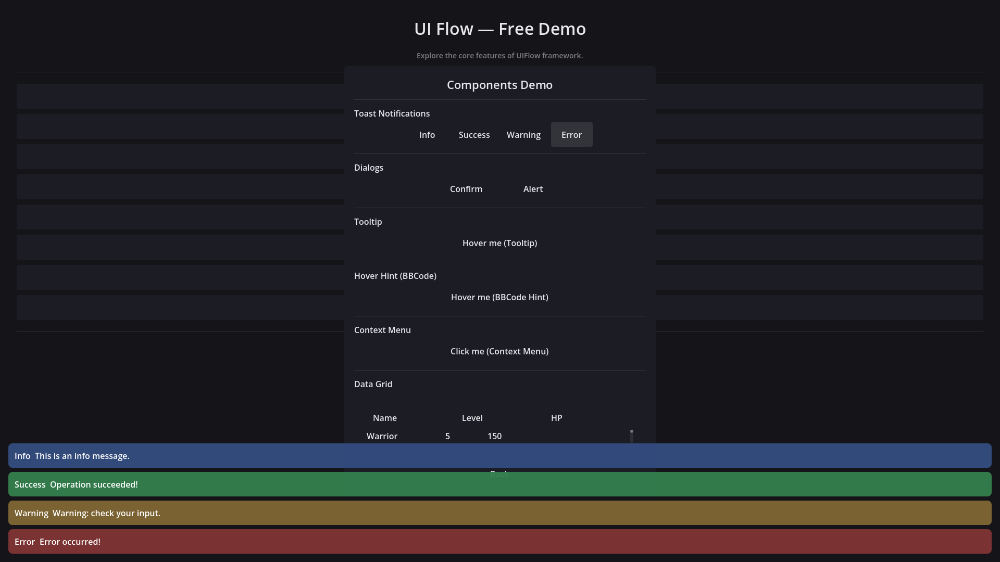
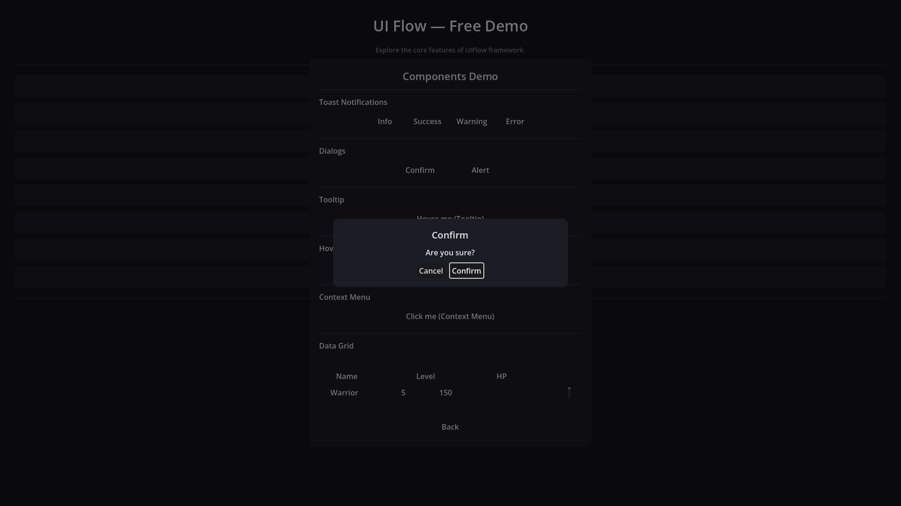
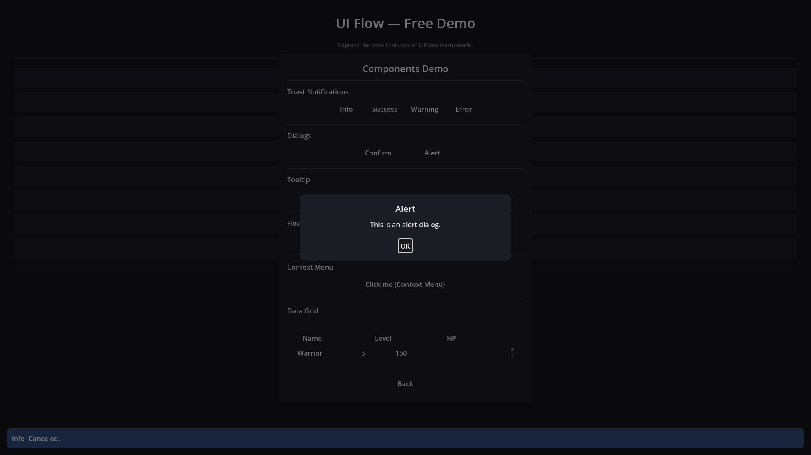
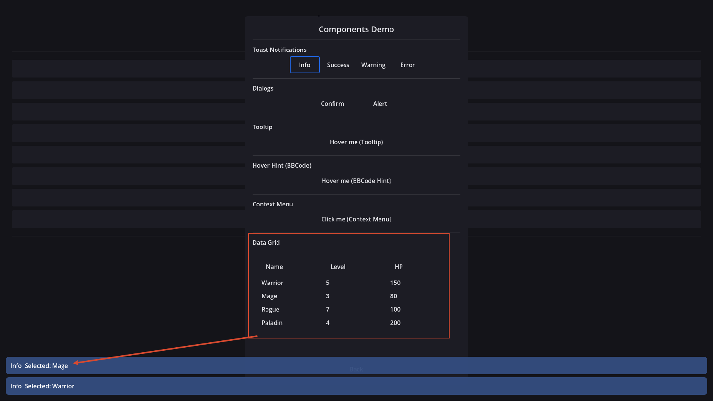
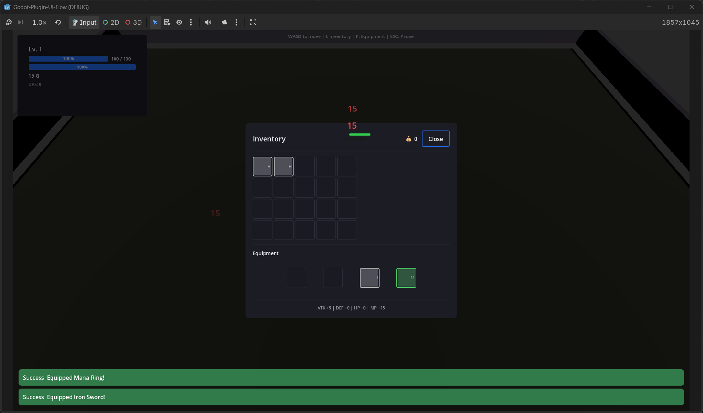

# Built-in Components

UIFlow Free provides a set of common UI components, accessible through `UIFlowUI` or as scene nodes.

## Toast

Lightweight popup notifications:

```gdscript
UIFlowUI.Toast.show_toast("Saved successfully", "success")
UIFlowUI.Toast.show_toast("Network disconnected", "error", 3.0)
```



### Customizing Toast

Change exported properties at runtime:

```gdscript
UIFlowUI.Toast.toast_position = UIFlowToast.Position.BOTTOM_CENTER
UIFlowUI.Toast.max_visible = 3
UIFlowUI.Toast.default_duration = 2.0
```

Register custom types with their own color, duration, sound, or even a custom item scene:

```gdscript
var achievement := UIFlowToastType.new()
achievement.bg_color = Color(0.2, 0.2, 0.2, 0.95)
achievement.text_color = Color.GOLD
achievement.default_duration = 5.0
achievement.custom_scene = preload("res://UIScene/MyToastItem.tscn")
UIFlowUI.Toast.register_type("achievement", achievement)
```

## Confirm / Alert Dialogs

```gdscript
UIFlowUI.Confirm.show_confirm("Delete save file?", "Are you sure?", _on_confirm, _on_cancel)
UIFlowUI.Alert.show_alert("Operation complete", "Your data has been saved.")
```




### Customizing Confirm / Alert

Both dialogs expose exported properties for button text, icons, and custom button scenes:

```gdscript
UIFlowUI.Confirm.confirm_text = "OK"
UIFlowUI.Confirm.cancel_text = "Back"
UIFlowUI.Confirm.cancel_first = false
UIFlowUI.Confirm.custom_button_scene = preload("res://UIScene/MyButton.tscn")

UIFlowUI.Alert.ok_text = "Got it"
UIFlowUI.Alert.ok_icon = preload("res://icon.svg")
```

Per-call overrides are also supported:

```gdscript
UIFlowUI.Confirm.show_confirm(
    "Quit", "Really quit?",
    func(): get_tree().quit(),
    Callable(),
    {"confirm_text": "Yes", "cancel_text": "No", "cancel_first": true}
)
```

For full control, subclass `UIFlowConfirmDialog` or `UIFlowAlertDialog` and override `_create_button()` or `_create_ok_button()`, then replace the default instance:

```gdscript
UIFlowUI.set_custom_confirm(my_custom_confirm)
UIFlowUI.set_custom_alert(my_custom_alert)
```

## DataGrid

Display tabular data with column definitions, sorting, and selection callbacks:

```gdscript
var grid := $DataGrid
grid.add_column("Name", 200)
grid.add_column("Level", 80)
grid.add_column("HP", 100)
grid.set_data([
    ["Warrior", 5, 150],
    ["Mage", 3, 80],
])
```

You can also define columns with `set_columns([{"title": "Name", "width": 200}])`.



## InventoryGrid / ItemSlot

Slot-based inventory grid with drag-and-drop, bound to an `InventoryData` resource. Slots show the item icon, or the first letter of the item name with a rarity-colored border when no icon is set:

```gdscript
var inventory := InventoryData.new(20)

var potion := ItemData.new()
potion.item_name = "Health Potion"
potion.rarity = ItemData.Rarity.COMMON
inventory.add_item(potion)

$InventoryGrid.setup(inventory)
```



The grid emits `item_right_clicked` and forwards per-slot `item_dropped` events so you can wire equipment slots, context menus (`UIFlowContextMenu`), and tooltips (`UIFlowTooltip`) — see the Survivors demo for a full example.

### Quick Equipment Binding

`UIFlowInventoryGrid.bind_equipment_slots()` removes the boilerplate for drag-and-drop between inventory and equipment:

```gdscript
$InventoryGrid.setup(inventory)
$InventoryGrid.bind_equipment_slots(equipment_data, {
    &"weapon": weapon_slot,
    &"chest": chest_slot,
})
```

Right-clicking an inventory item emits `item_right_clicked(item, slot_index, pos)`; equippable items can be equipped directly or through a context menu.

## EquipmentGrid

`UIFlowEquipmentGrid` creates a labeled grid of equipment slots that handle drop-to-equip, type filtering, and display sync automatically:

```gdscript
var grid := UIFlowEquipmentGrid.new()
grid.slot_names = {&"weapon": "Weapon", &"chest": "Chest"}
add_child(grid)
grid.setup(equipment_data, inventory_data)
grid.slot_right_clicked.connect(_on_equipment_right_clicked)
```

Each slot is a `UIFlowItemSlot` with `setup_equipment()` already wired, so drag-and-drop from an inventory grid works out of the box.

## VirtualList

Large lists that only render the visible area:

```gdscript
virtual_list.bind(data_array, item_template, _setup_item)
```

## Tooltip / HoverHint

Show hints on hover. Popups are reparented to a high [CanvasLayer] (above the page stack) while visible:

```gdscript
$HoverHint.hint_text = "Attack +10"
UIFlowHoverHint.attach($Button, "[b]Rich Text[/b]\nSupports BBCode", true)
UIFlowTooltip.attach($Button, "Click to confirm")
```

## Input Prompts

`UIFlowInputPrompt` is a small badge + label chip for on-screen button hints. Letter badges work out of the box; optional Kenney Input Prompts (CC0) textures can be dropped in `addons/ui_flow/assets/input_prompts/` and assigned to `icon`.

```gdscript
add_child(UIFlowInputPrompt.make("A", "Confirm", Color(0.2, 0.72, 0.32)))
```

## Code Overlay

Free Demo uses `UIFlowCodeOverlay` (CanvasLayer) to show page API snippets. Press **F1** to toggle. Prefer this over the legacy sidebar `UIFlowCodePanel`, which could sit under the page layer.

## Input Action Bar

`UIFlowActionBar` renders the current top page's declared `UIInputActionNode` entries as a hint bar (key/icon + label), similar to Unreal CommonUI's bound action bar. Drop it into a HUD scene — it auto-follows the navigation stack:

```gdscript
var bar := UIFlowActionBar.new()
add_child(bar)  # auto-binds to the top page
```

Actions show their `icon` when set, otherwise the key bound to `godot_action` (e.g. `[I]`). Disabled actions are hidden by default; set `show_disabled = true` to keep them visible but dimmed. See the Survivors demo HUD for a live example.

## Children Switcher

`UIFlowChildrenSwitcher` applies one discrete `state` across **multiple** NodePath targets at once (optional patches: `visible`, `modulate`, `scale`, `disabled`, `font_size`, …). That multi-child switch is the point — card selected/disabled, slot empty/filled, step indicators.

```gdscript
$CardSwitcher.set_state(1)                 # updates icon + title + detail + button together
$CardSwitcher.set_state_by_name("selected")
```

In the editor, change **Preview State** to live-preview. Use **Bake Current State** to write that look into the scene baseline (and `initial_state`); casual saves restore the baseline so unrehearsed previews do not pollute the `.tscn`.

See Free Hub → **Workflow Glue** for a multi-target card example plus the other glue components.

## Workflow Glue

Lightweight scene nodes that remove everyday UI boilerplate. Demo: Free Hub → **Workflow Glue**.

| Component | Role |
|---|---|
| `UIFlowPageOpener` | Push / replace / async / instance-open a page from a Button |
| `UIFlowPageCloser` | Pop / pop-to-root / close-by-script |
| `UIFlowChildPool` | `ensure_count(n, init_fn)` — ReserveChildren without a data array |
| `UIFlowInputRelay` | Local InputMap → signal (optional focus/visibility gates) |
| `UIFlowHoldRepeater` | Hold-to-repeat ticks for steppers / fast scroll |
| `UIFlowCooldownGate` | Rate-limit presses (`accepted` / `rejected`) |
| `UIFlowVisibilityGroup` | Exactly one of N targets visible |
| `UIFlowAutoFocus` | Grab focus on ready / when page shown again |

```gdscript
# Button with opener child — no pressed handler needed
$OpenShopBtn/PageOpener.page_script = ShopPage
$OpenShopBtn/PageOpener.mode = UIFlowPageOpener.Mode.PUSH

# Fixed skill slots
$SkillPool.ensure_count(6, func(slot, i): slot.setup(skills[i]))
```

## Custom Components

Extend `UIFlowComponentBase` to implement project-specific components that follow the UIFlow lifecycle.
