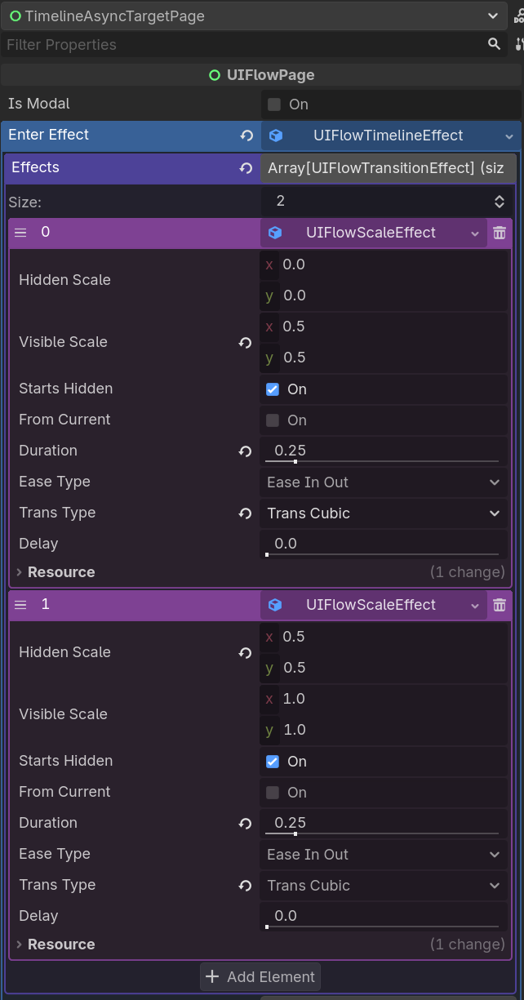

# Timeline 与 Async

UIFlow 支持把多个动画/等待组合成一段 **Timeline**，并通过 `await` 与异步逻辑结合。

## Timeline 效果

`UIFlowTimelineEffect` 由多个 `UIFlowEffect` 步骤组成，可配置：

- **Effects**：每段效果数组。
- **Step Delays**：每段开始前的延迟。
- **Step Wait for Completion**：是否等待该段完成才进入下一段。

## 两段式 Scale Punch 示例



```gdscript
# 配置内容：
# Step 0: UIFlowScaleEffect，duration 0.15，from 0.0 to 0.5，curve punch out
# Step 1: UIFlowScaleEffect，duration 0.15，from 0.5 to 1.0，curve punch out
```

这样页面进入时会先快速放大到 0.5，再弹到正常尺寸，形成 punch 弹性效果。

## Async 流程

在页面中可以直接 `await` UIFlow 动画：

```gdscript
func _play_open_sequence() -> void:
    await UIFlow.Animator.tween(self, UIFlowTweenProp.MODULATE, Color.WHITE, 0.2).finished
    await UIFlow.Animator.tween(self, UIFlowTweenProp.SCALE, Vector2.ONE, 0.3).finished
    _enable_input()
```

## 与导航结合

```gdscript
func _on_start() -> void:
    await UIFlow.Animator.tween(self, UIFlowTweenProp.OPACITY, 0.0, 0.2).finished
    UIFlow.push(GamePage)
```

## 建议

- 复杂 enter / exit 优先使用 `UIFlowTimelineEffect` 资源，而不是在代码里手写。
- 简单一次性动画可在代码中用 `await` 快速实现。
