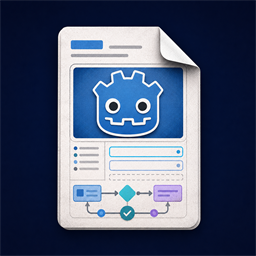

<div class="uf-docs-hero" markdown="0">
  
  <div>
    <p class="uf-kicker">Godot 4.6 · Free MIT</p>
    <h1>UIFlow Docs</h1>
    <p>Stack-based page navigation, lifecycle, transitions, binding, and gamepad prompts — documented for shipping menus, not reinventing them.</p>
    <div class="uf-cta-row">
      <a class="uf-cta uf-cta-primary" href="https://indieshade.github.io/uiflow/">Product page</a>
      <a class="uf-cta uf-cta-ghost" href="getting-started/installation/">Install Free</a>
      <a class="uf-cta uf-cta-ghost" href="https://github.com/indieshade/uiflow">GitHub</a>
    </div>
  </div>
</div>

UIFlow is a UI workflow framework for **Godot 4.6+**. It provides stack-based page navigation, page lifecycle management, transition animations, data binding, an event bus, and a set of reusable UI components.

This documentation covers the **UIFlow Free** plugin. Pro features are called out in the [Pro](pro/index.md) section where relevant.

## Key Features

- **Stack navigation**: `push` / `pop` / `replace`, with modal support and back interception.
- **Lifecycle hooks**: `_on_created` → `_on_opened` → `_on_after_opened` → `_on_hidden` / `_on_shown` → `_on_closed` / `_on_destroyed`.
- **Transitions**: built-in Fade, Slide, Scale, Timeline, and more. Configure enter / exit per page.
- **Data binding**: `bind_property`, `bind_signal`, `bind_list`. Bindings are automatically cleaned up when a page closes.
- **Event bus**: pub/sub, sticky values, one-shot subscriptions, and auto-cleanup by subscriber.
- **Async / Timeline**: combine animations and async logic with `await`.
- **Reusable components**: Toast, Confirm / Alert dialogs, DataGrid, VirtualList, Tooltip, workflow glue, input prompts, and more.
- **Gamepad UX**: top-page focus navigation, device-aware ActionBar prompts, AxisBinder for stick-driven sliders.

## Use Cases

- RPG / ARPG / card / simulation games that need a complex UI stack.
- Mid-size projects that want each screen managed as an independent page.
- Teams that prefer GDScript with optional C# wrappers.

## Quick Start

```bash
godot --path . --scene res://addons/ui_flow/examples/main.tscn
```

Or follow [Installation](getting-started/installation.md) to integrate the plugin into your own project.
