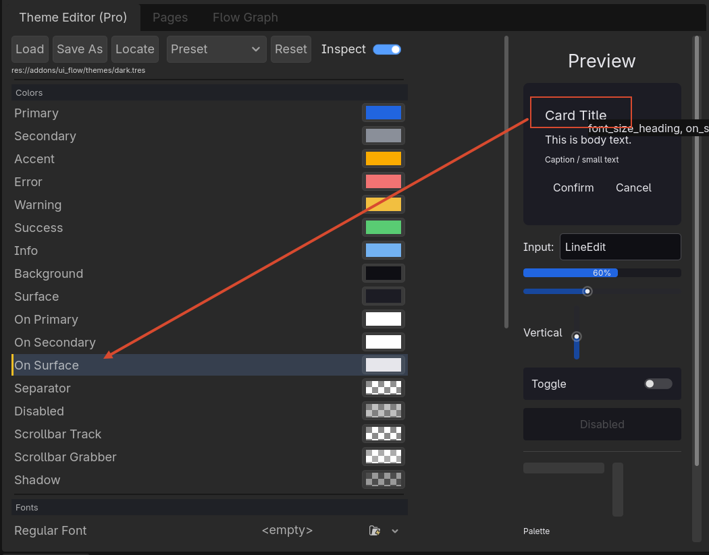
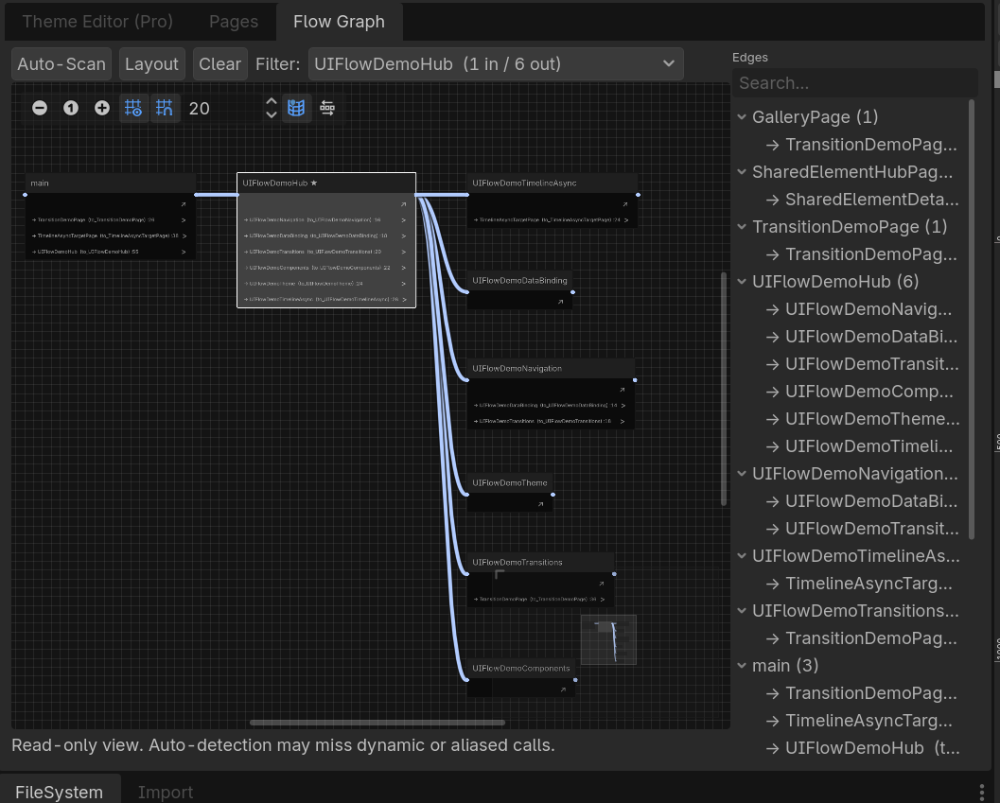

# Pro Editor Tools

!!! tip "Pro Feature"
    These editor tools are only available in **UIFlow Pro**.

UIFlow Pro adds several docks and inspectors to the Godot editor to speed up UI workflow.

## Theme Manager

Manage native Godot Theme resources for your UIFlow project without leaving the editor.

- Browse themes in a split view: **UIFlow Presets** (dark, light, ocean, forest, high contrast, warm) and **Project Themes** (every `.tres` Theme discovered under `res://`).
- Create a new empty Theme file with **New Theme**.
- Rename, delete, open in Godot's Theme inspector, reveal in the FileSystem dock, or apply the selected Theme to UIFlow.
- Inspect basic Theme info: file path, size, and counts of icons, styleboxes, fonts, colors, constants, and types.

The dock appears automatically when the UIFlow Pro plugin is enabled. Select the **Theme Manager** tab in the **UIFlow Pro** dock.

## Flow Dock / Flow Graph

A visual graph of your page navigation flow.

- See all discovered pages as nodes.
- View push/pop relationships as edges.
- Jump to a page scene or script from the graph.

This is useful for reviewing whether a complex UI flow has unreachable pages or circular navigation.

## Page Viewer

A dock that lists all pages found in the configured scene directories.

- Filter by class name or scene path.
- Open the scene or script with one click.
- See which pages are referenced by the Flow Graph.

## Profiler

A lightweight profiler for UI performance:

- Track navigation timing.
- Monitor object pool hit/miss rates.
- See event bus subscription counts.

## Enabling Pro Editor Tools

After enabling the **UIFlow Pro** plugin in **Project Settings → Plugins**, the docks appear automatically. You can rearrange them like any other Godot dock.

!!! tip
    Pro editor tools only work inside the Godot editor with the Pro plugin enabled. They are stripped from exported builds.
